 

**Now** — building things at the edge of what AI can do and what people actually need.

 

| Selected work | |
|:--|:--|
| [**DeutschPath**](https://github.com/sjelodari/DeutschPath) | AI-powered language-learning platform — book reader, spaced-repetition vocab, grammar roadmap. **v1.0 shipped, solo, zero to launch** · Next.js · Gemini Vision |
| [**PhysioNet 2025**](https://github.com/sjelodari/Chagas_UBT_Physionet_Challenge) | 15 MB CNN–BiLSTM–Attention model for signal classification in a global research competition. **Top 10 of 41 teams worldwide** · PyTorch |
| [**Clinical Trials NLP**](https://github.com/sjelodari/ClinicalTrialIPDClassifier) | Domain-specific BERT models classifying records at scale. **Master's thesis, grade 1.0 · presented at MIE 2024, Athens** |
| [**ECG-Simulator**](https://github.com/sjelodari/ECG-Simulator) | Interactive browser tool teaching signal processing in real time. **Used in university teaching** |

 

**Toolbox** — Product strategy · Agile / Scrum · Python · PyTorch · Transformers · TypeScript · Next.js · LLM & agent orchestration

 

[saberjelodari.com](https://www.saberjelodari.com) · Bayreuth, Germany

