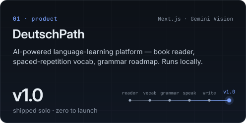
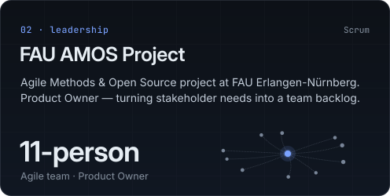
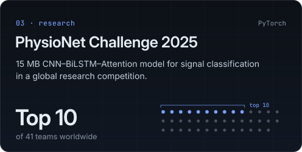
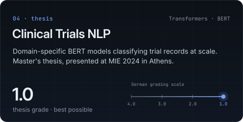

<a href="https://www.saberjelodari.com">
  <picture>
    <source media="(prefers-color-scheme: dark)" srcset="v3-dark.svg">
    <source media="(prefers-color-scheme: light)" srcset="v3-light.svg">
    
  </picture>
</a>

 

**Now** — building things at the edge of what AI can do and what people actually need.

 

<code>selected work</code>

<a href="https://github.com/sjelodari/DeutschPath"><picture><source media="(prefers-color-scheme: dark)" srcset="cards/deutschpath-dark.svg"><source media="(prefers-color-scheme: light)" srcset="cards/deutschpath-light.svg"></picture></a> <picture><source media="(prefers-color-scheme: dark)" srcset="cards/amos-dark.svg"><source media="(prefers-color-scheme: light)" srcset="cards/amos-light.svg"></picture>
<a href="https://github.com/sjelodari/Chagas_UBT_Physionet_Challenge"><picture><source media="(prefers-color-scheme: dark)" srcset="cards/physionet-dark.svg"><source media="(prefers-color-scheme: light)" srcset="cards/physionet-light.svg"></picture></a> <a href="https://github.com/sjelodari/ClinicalTrialIPDClassifier"><picture><source media="(prefers-color-scheme: dark)" srcset="cards/thesis-dark.svg"><source media="(prefers-color-scheme: light)" srcset="cards/thesis-light.svg"></picture></a>

Also — <a href="https://github.com/sjelodari/ECG-Simulator"><b>ECG-Simulator</b></a>, an interactive browser tool for teaching signal processing in real time, used in university teaching.

 

**Toolbox** — Product strategy · Agile / Scrum · Python · PyTorch · Transformers · TypeScript · Next.js · LLM & agent orchestration

 

[saberjelodari.com](https://www.saberjelodari.com) · Bayreuth, Germany

